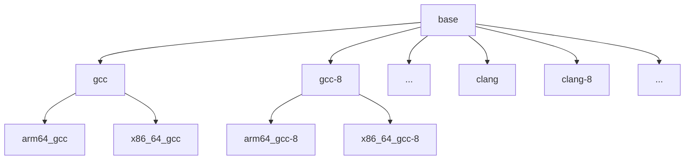

# TuxMake docker images

## Image design

TuxMake provides Docker container images for all of its supported
architecture/toolchain combinations. These images have the following goals:

- Be as small and portable as possible
- Contain the tools required to build kernels, and nothing else.

The images are based on Debian, and organized in three levels:

- Base images: contain very basic utilities that are used by all toolchains,
  for example `make`, tar, file compressors, etc.

- Build images: based on the base images, plus a native toolchain.  e.g.  a
  `x86_64` image will contain the native `x86_64` compilers. There is a
  "default version" for each toolchain, which gets you the version available in
  Debian `stable`. The versioned toolchains are obtained from the Debian
  release that has them available, usually `stable` or `testing` for newer
  versions.

- Cross build images: based on the build images, plus a crossbuild toolchain.

## Build process

- The list of base and build images is specified in the
  [Docker runtime configuration](../../tuxmake/runtime/docker.ini).
- Before anything, you need to run [`./configure`](configure) to generate the
  list of images to be built.
- The build process is then controlled by [Makefile](Makefile).
  - `make list` will list all the images that can be built.
  - `make show` will list all the images that you have already built.
  - `make test` runs tests for [`configure`](configure).
  - `make` builds all the images
- The list of achitectures to build cross toolchain images for is provided by
  tuxmake itself, i.e. all architectures defined in tuxmake will have their
  images built.
- The dockerfiles are parameterized:
  - Base images are built from [Dockerfile.base](Dockerfile.base).
  - Build and cross build images are built from [Dockerfile.build](Dockerfile.build).

## Automated builds

The TuxMake repository has [scheduled CI
runs](https://gitlab.com/Linaro/tuxmake/-/pipeline_schedules)  that will
automatically build all images, and publish them on Dockerhub. Each image has a
different update periodicity, what is defined in the [Docker runtime
configuration](../../tuxmake/runtime/docker.ini). Most images are rebuilt once
a month.
